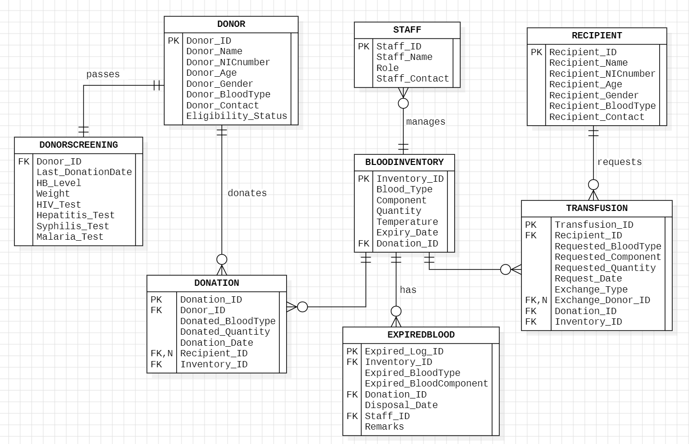

# Blood Bank Management System

A comprehensive *Blood Bank Management System* built as a database project with a minimalistic Python-based user interface. The application ensures efficient management of donor, recipient, and blood inventory data while offering role-based access to admins, staff, donors, and recipients.

The backend utilizes Oracle SQL for robust and reliable data storage, leveraging advanced database features such as triggers, procedures, and primary operations.

## Introduction

This project simulates a Blood Bank system catering to a hospital's needs. It keeps track of:

* Donors, their medical history and donation records.
* Recipients and their transfusion records.
* Blood inventory, including donations and expired blood.
* Staff details and their access levels.

The system provides secure, role-based access:

* **Admin**: Full access to all records. Admins can add, edit, or delete records after logging in with a password.
* **Staff**: Limited access to add medical records.
* **Donor/Recipient**: View-only access to their respective records by entering their ID.

The application is designed to streamline daily blood bank operations and ensure data integrity.

## Project Overview 

Here is the Entity Relationship Diagram of the Blood Bank Management System.

## Features

* **Role-Based Access**:
  Secure login with role-specific permissions.
* **Data Management**:
  * Add, edit, delete donor and recipient records.
  * Maintain blood inventory and medical history.
  * Store information on expired blood.
* **Daily Reports**:
  Automatically generates daily transaction and inventory report.
* **Database Operations**:
  * Advanced use of triggers for rule-based data insertion.
  * Frequently accessed tables have pre-defined procedures for efficient operation.
* **Minimalistic User Interface**: Simple and intuitive navigation.

## Technologies Used

* **Frontend**: Python (Tkinter for GUI)
* **Backend Database**: Oracle SQL

## Setup and Installation

1. Clone this repository.
2. Install required Python libraries.
3. Configure Oracle Database by importing the sql script.
4. Update database connection in the Python application.
5. Run the application.

## Screenshots

## Screenshots

## Screenshots

  
  
  
  

## Future Improvements

* *Notification alerts*:
  Add a notification system for low stock alerts.
* *AI enhancements*:
  Integrate machine learning for donor-recommendation.
* *System Expansion*:
  Develop a web-based version for remote access.
* *Data Visualization*:
  Include graphical representations of stock and donor statistics.

## Acknowledgment

This application was developed as a semester project for our Database Systems course and is the result of a collaborative effort between me and my friend @.

